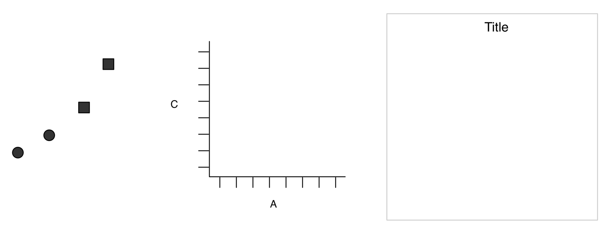
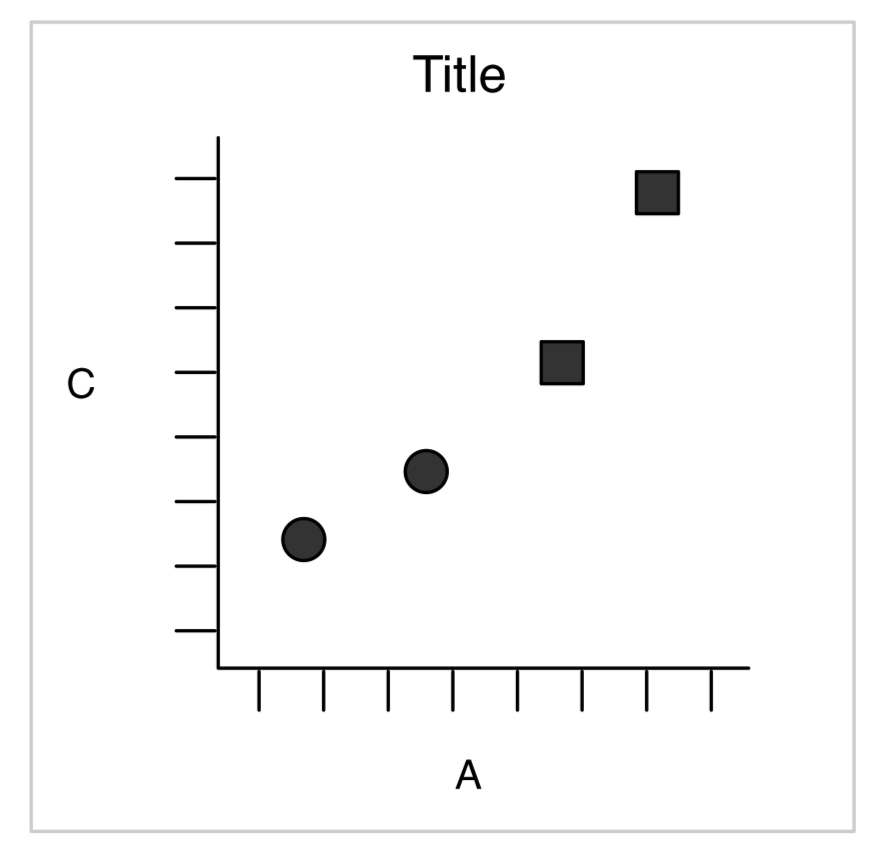
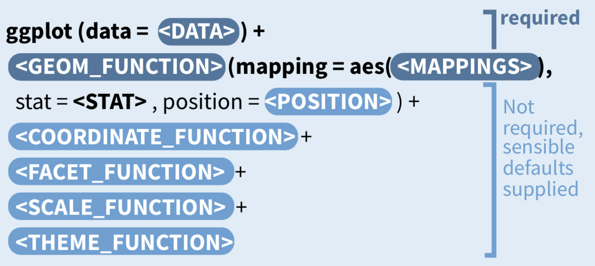

# R in OLS

```{r, include=FALSE}
knitr::opts_chunk$set(echo = TRUE, message=FALSE)
```

## 複製貼上
產生程式區塊複製貼上功能
安裝方式：
```{r, eval=FALSE}
devtools::install_github("RLesur/klippy")
```

```{r klippy, echo=FALSE, include=TRUE}
klippy::klippy()
```

## setup

```{r}
library("AER")
library("ggplot2")
library("dplyr")
library("knitr")
```


## dataframe物件


```{r}
data("Journals")
```


<div class="question">
Journal這個dataframe的結構(structure)是什麼？有幾個變數？每個變數物件的類別(class)又是什麼？
</div> 
<br>
找出Journal資料的詳細說明。


## 資料處理：產生新變數 dplyr::mutate

```{r ch2-summary, results='hide'}
Journals %>% mutate(citeprice=price/citations) -> journals
summary(journals)
```

## 因果問句

<div class="question">
期刊的價格(citeprice，平均文獻引用價格)如何影響其圖書館訂閱量(subs)? 
</div>
<br>

```{r ols-paircorr-r, echo=TRUE}
library(psych)
journals %>% 
  select(citeprice,subs) %>%
  pairs.panels()
```


```{r ols-paircorr2-r}
journals %>% 
  select(citeprice,subs) %>%
  mutate_all(log) %>%
  pairs.panels()
```

<div class="question">
為什麼取log後，兩者的相關度變高？它表示兩個變數變得更不獨立嗎？
</div>

## 效應評估

<div class="alert alert-warning">
單純比較不同「期刊價格」(citeprice)的期刊所獨得的圖書館「訂閱數」(subs)變化並無法反應真正的「期刊價格」效應，原因是「立足點」並不與「期刊價格」獨立。
</div>

<div class="question">
這裡「立足點」指得是什麼？
</div>

<button data-toggle="collapse" data-target="#ch2-y0q">Read more...</button>
<div id="ch2-y0q" class="collapse">
「低價格下的訂閱數」（包含高價格期刊若採低價格的訂閱情境）。
</div>
<br>
<div class="question">
你認為高價期刊，若採低價，它的訂閱數會與目前低價期刊相同嗎？為什麼？
</div>
## 進階關連分析

數值變數v.s.數值變數

```{r ols-paircoor3-r, results='hide'}
# 判斷變數是否為數值類別
is_numeric<-function(x) all(is.numeric(x))
# 計算數數與citeprice的相關係數
cor_citeprice<-function(x) cor(x,journals$citeprice)

journals %>%  
  select_if(is_numeric) %>%
  summarise_all(cor_citeprice) %>%
  kable()
```

<div class="question">
期刊越重要，其引用次數越高，因此高引用次數的期刊，你認為它在「低價格下的訂閱數」（立足點）會比較高還是低？
</div>
<br>
<div class="question">
承上題，單純比較「期刊引用單價」高低間的「訂閱數量」差別，所估算出來的價格效果以絕對值來看會高估、還是低估？為什麼？
</div>

## 複迴歸模型

```{r}
journals %>% 
  lm(log(subs)~log(citeprice),data=.)

journals %>%
  lm(log(subs)~log(citeprice)+foundingyear,data=.)
```


## 模型比較

```{r ols-comp-r, results='hide', warning=FALSE}
journals %>% 
  lm(log(subs)~log(citeprice),data=.) -> model_1
journals %>%
  lm(log(subs)~log(citeprice)+foundingyear,data=.) -> model_2

library(sandwich)
library(lmtest)
library(stargazer)

#使用vcovHC函數來計算HC1型的異質變異（即橫斷面資料下的線性迴歸模型）
coeftest(model_1, vcov. = vcovHC, type="HC1") -> model_1_coeftest
coeftest(model_2, vcov. = vcovHC, type="HC1") -> model_2_coeftest

stargazer(model_1, model_2, 
          se=list(model_1_coeftest[,"Std. Error"], model_2_coeftest[,2]),
          type="html",
          align=TRUE)
```

關於`vcovHC()`更多type的探討，請見：
Zeileis A (2006), Object-Oriented Computation of Sandwich Estimators. Journal of Statistical Software, 16(9), 1–16. URL http://www.jstatsoft.org/v16/i09/.
<!--
## 圖形語法架構


{width=30%}

{width=50%}

geom_point: 幾何物件_（散佈）點

<button id="button1" onclick="CopyToClipboard('ols-point')">Click to copy</button>
<div id="ols-point">
```{r}
journals %>% 
  ggplot()+
  geom_point(mapping=aes(y=log(subs),x=log(citeprice)))
```
</div>
-->
